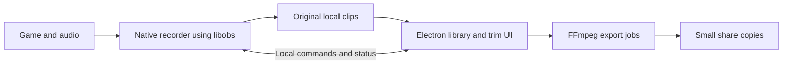

# Initial architecture research

Historical discussion material. The later decisions in [docs/product.md](docs/product.md) supersede this assessment, including cross-platform packaging and keeping trimming in AttaCut. Current implementation limits and verification results belong in [docs/development-status.md](docs/development-status.md).

Research date, 6 October 2026. This is a recommendation for discussion, not an implementation specification or an approved feature list.

The user's priorities govern this assessment. Friends plan.md is supporting reference. AttaCut was inspected through its source code, package configuration, and project documentation. Neither AttaCut's live UI nor a capture prototype was run. Performance conclusions below are hypotheses to validate.

## Recommendation

Build a Windows-first application with a native C++ background recorder using libobs and selected OBS modules. Use Electron, React, and TypeScript for the library, quick trimming, settings, and export experience. Use FFmpeg for share exports. Bun remains appropriate for the JavaScript tooling.

Keep the recorder independent of the UI process. The eventual background mode should run the native recorder and tray while launching Electron when the user opens the library. An earlier prototype can leave Electron's main process alive while destroying its renderer window. Measure both configurations before adding native tray and updater complexity.

libobs supports custom applications and explicitly separates initialization, sources, encoders, and outputs from the frontend. Reusing it does not require OBS Studio's Qt interface. [OBS frontend documentation](https://docs.obsproject.com/frontends)

Streamlabs provides an existing example of OBS and Electron working together. Its obs-studio-node project supplies bindings and a native build system. Evaluate it as an integration candidate, including its dependency versions, packaging, and background process ownership. A small helper using upstream libobs is my preferred starting hypothesis because AttaClip needs fewer controls. [Streamlabs bindings](https://github.com/streamlabs/obs-studio-node)

## Options

| Approach                                              | Benefits                                                                 | Costs                                                                                                                | Assessment                                                                                               |
| ----------------------------------------------------- | ------------------------------------------------------------------------ | -------------------------------------------------------------------------------------------------------------------- | -------------------------------------------------------------------------------------------------------- |
| Fork the full OBS Studio application                  | Working recording configuration, existing Qt UI, mature capture behavior | Replace much of the interface, add a library and sharing flow, maintain changes across upstream releases             | Reasonable if we deliberately want a native Qt product. Hiding controls alone will not produce AttaClip. |
| Control installed OBS through its API                 | Fast way to test replay saving and the sharing workflow                  | Separate installation, two applications, source/profile configuration and ownership problems                         | Useful experimental route or companion app. Weak fit for a seamless standalone product.                  |
| Custom native recorder using libobs, with Electron UI | Mature capture modules, familiar UI stack, independent capture lifecycle | Native builds, module packaging, recorder control code, GPL obligations                                              | Best balance for the stated priorities.                                                                  |
| Electron desktop capture and browser recording        | Familiar development model, easy basic demonstration                     | Need to establish encoder control, audio routing, game capture behavior, long buffers and browser lifecycle behavior | Suitable for a limited screen recorder. I would not choose it for the game clipping core.                |
| Own native Windows capture and encoding pipeline      | Full control over implementation and dependencies                        | Own synchronization, device recovery, buffering, game compatibility and encoder integration                          | Viable, but the largest engineering commitment before users get the main benefit.                        |

Electron has desktop/window capture APIs, so a working recorder does not require OBS. Windows also exposes native display/window capture. Those APIs do not provide the complete clipping product. The recommendation above is an engineering judgment about the work AttaClip would inherit. [Electron desktop capture](https://www.electronjs.org/docs/latest/api/desktop-capturer), [Microsoft screen capture](https://learn.microsoft.com/en-us/windows/apps/develop/media-authoring-processing/screen-capture)

OBS WebSocket ships with OBS Studio and provides a practical route for an early companion prototype. Use authenticated local control. [OBS WebSocket](https://github.com/obsproject/obs-websocket)

## Proposed responsibilities

The recorder owns capture, audio routing, encoding, rolling history, clip hotkeys, and truthful recording status. Closing or crashing the UI must not stop it. Run it as a normal background process in the logged-in user's session, not a Windows service in Session 0.

The UI owns browsing, metadata, album membership, trimming choices, and share settings. Clips remain ordinary video files. A local database can store names, favorites, album membership, and derived metadata. Folder discovery alone cannot reconstruct those user choices, so offer a way to export or back up that metadata. A clip can belong to multiple albums without duplicating its video.

Connect the processes with a small local command protocol, such as a Windows named pipe restricted to the current user. Pass settings, clip requests, and status. Keep raw video frames out of JavaScript.

Bundle matching recorder libraries, capture modules, encoder modules, and helper binaries. Pin a tested upstream release. Retain a small, reviewable set of changes, preferably an AttaClip output module when custom buffer behavior becomes necessary.

## What OBS does and what AttaClip still needs

OBS's stock replay output retains encoded packets in memory, has time and size settings, and exposes a save operation over the retained history. It handles one active mux operation at a time. Its public save procedure does not accept an arbitrary requested duration. [Replay output source](https://raw.githubusercontent.com/obsproject/obs-studio/master/plugins/obs-ffmpeg/obs-ffmpeg-mux.c)

For an initial prototype, retain one maximum history window, save it, and derive shorter clips afterward. For production, investigate selecting the requested packet interval in an AttaClip output module. Capture each request's intended end time when the hotkey fires. A delayed save must not quietly change which moment it captures. Repeated requests also need explicit queueing or snapshot behavior.

Keyframes affect whether a clip can begin cleanly without re-encoding. Decide whether initial saves include a small amount of extra lead-in, then offer accurate trimming during share export. Avoid running a separate recorder for every duration.

Buffer memory matters more than the UI framework for long histories. At a sustained 20 Mbps, 2 minutes contains about 300 MB of video and 10 minutes about 1.5 GB, before audio and other allocations. At 50 Mbps, 10 minutes contains about 3.75 GB. These are arithmetic estimates, not measurements of OBS's process memory.

Start with a short RAM history, perhaps 60 to 120 seconds. If ten-minute history is a core need, compare RAM buffering with encoded disk segments. At 20 Mbps, continuously writing segments produces roughly 9 GB of video writes per hour. Disk history trades memory for writes, cleanup work and privacy decisions about unsaved history.

Show buffer memory, temporary/export disk space, and saved library storage separately. Never call all three the clip buffer. When a memory cap reduces available history, show the actual retained time.

Game capture should be the first method we test. OBS describes it as its most efficient game capture option. Its documentation also records games that need window capture or elevated capture, so reusing OBS code does not guarantee universal compatibility. Test packaged AttaClip binaries and hook behavior on the games people actually play. [Game capture source](https://obsproject.com/kb/game-capture-source), [Capture troubleshooting](https://obsproject.com/kb/game-capture-troubleshooting)

Automatic detection, game changes, launchers, hybrid GPU laptops, monitor changes, sleeping and waking, microphone disconnects, full disks, capture failures, and update restarts remain AttaClip responsibilities. Do not silently switch to full desktop recording when game capture fails.

## Sharing and compression

Discord currently documents a 20 MB free upload limit and also notes upload-limit experiments. Keep the preset editable. Target a little below the configured limit and verify the actual file size. [Discord attachment FAQ](https://support.discord.com/hc/en-us/articles/25444343291031-File-Attachments-FAQ)

For a decimal 20 MB cap, a 5 percent reserve, and 128 kbps mixed audio, the approximate video budget is:

`video bits per second = 20,000,000 * 8 * 0.95 / duration seconds - 128,000`

| Duration   | Approximate video bitrate |
| ---------- | ------------------------- |
| 30 seconds | 4.94 Mbps                 |
| 60 seconds | 2.41 Mbps                 |
| 2 minutes  | 1.14 Mbps                 |
| 10 minutes | 0.13 Mbps                 |

These are file budget calculations. They do not predict visual quality. Fast gameplay will expose compression damage at low bitrates. Quick trimming should be part of the share flow from the first release.

Record a good local original. When sharing, choose a range and audio mix, calculate the budget, select suitable resolution and frame rate, encode a separate copy, and validate its size, duration, tracks and playback. Retry with a revised budget if necessary, with a bounded retry policy and a clear failure message. Cache successful derivatives so sharing the same selection does not encode it again.

Start with H.264 video and AAC audio in MP4 as a compatibility choice. Evaluate HEVC and AV1 against real Discord desktop and phone playback before offering them as defaults. Your RTX 3070 supports hardware H.264 and HEVC encoding but lacks AV1 encoding. Your RTX 4060 laptop supports AV1 encoding. Detect hardware capabilities rather than exposing unsupported choices. [NVIDIA support matrix](https://developer.nvidia.com/video-encode-decode-support-matrix)

A fast export can use hardware encoding. A slower export can use software two-pass encoding when its quality tradeoff is useful. FFmpeg's file-size stop option is unsuitable as the compression strategy because it stops writing and can exceed the requested byte limit. [FFmpeg export options](https://ffmpeg.org/ffmpeg.html)

Local export and public link sharing are different features. A portable public URL requires uploading the clip to a reachable host, or running a reachable server. For version one, produce a file that users can drag into Discord or reveal in Explorer. Hosted links can later use a provider the user selects.

## Audio, privacy and storage

Preserve separate game and microphone tracks in the original. Optionally keep a mixed default track for ordinary playback. Share copies should contain a single mixed track reflecting the user's microphone and voice-chat choices. Do not depend on recipients choosing between alternate tracks.

OBS offers per-application audio capture and documents compatibility limitations. Desktop audio and game-only audio are different modes. Discord separation depends on capturing processes correctly, including child processes and device changes. Test this on both Windows 10 and Windows 11. [OBS application audio guide](https://obsproject.com/kb/application-audio-capture-guide)

Medal's current policy permits AI-related use of uploaded clips and associated data, identifies General Intuition as an AI joint controller, and describes opt-outs. That supports the privacy concern. It does not establish how much money Medal makes from those activities or prove that all recordings kept only on a user's drive are uploaded. [Medal privacy policy](https://medal.tv/privacy)

For AttaClip, propose no account requirement, no clip uploads, no analytics by default, local diagnostics, and optional update checks. Exporting a copy to Discord places it under Discord's policies. Local-first controls AttaClip's behavior, not the destination's.

Start with warnings and cleanup of temporary files. Automatic deletion of saved clips should require an explicit policy and protect favorites and imported files. Maintain free-space headroom for pending saves and exports.

## What to carry over from AttaCut

Reuse selected behavior and code after checking dependencies. Keep the projects separate.

- [Update manager](D:/Coding/AttaCut/src/main/updates.ts) and [update chip](D:/Coding/AttaCut/src/renderer/src/components/UpdateChip.tsx). Background preparation and an explicit restart action fit AttaClip. Coordinate recorder shutdown and package the UI, engine, modules and FFmpeg together. An update must not restart recording mid-game without the user's action.
- [Media process runner](D:/Coding/AttaCut/src/main/media/process.ts). Cancellation, idle watchdogs, hidden subprocess windows and scheduling are useful. CPU process priority does not by itself prevent GPU encoder contention.
- [Media probing](D:/Coding/AttaCut/src/main/media/probe.ts) and [output verification](D:/Coding/AttaCut/src/main/media/verify.ts). Adapt checks to controlled recorder formats and size-targeted exports.
- Trim controls, compact menus, preferences, keyboard conventions and source protection. Reuse the interaction ideas, then design for a clip library rather than one open recording.

AttaCut's lossless export machinery solves a broader format problem than AttaClip initially needs. Compression to a size target requires a new policy. Its UpdateManager also currently depends on a BrowserWindow, so an on-demand UI needs a different owner for persistent update state.

The capture engine does not dictate the interface. I would use a library as the main screen, a player with quick trim and share controls for a selected clip, and a small persistent recording status. OBS's scenes, mixer and streaming layout solve a different workflow.

## License decision

libobs is GPL version 2 or later, rather than MIT or a permissive SDK. Plan GPL-compliant source distribution for the recorder and its changes. My simplest proposal is a GPL-compatible AttaClip distribution retaining the MIT notices on reused AttaCut code. A separate process is an engineering boundary, not an automatic exemption from license requirements. Resolve the intended license before implementation if MIT-only distribution matters. [libobs license header](https://raw.githubusercontent.com/obsproject/obs-studio/master/libobs/obs.h), [GNU license FAQ](https://www.gnu.org/licenses/gpl-faq.en.html)

## Prototype and release order

First prove a packaged native recorder can capture a real game with hardware encoding, retain 60 to 120 seconds, save on a hotkey, and preserve synchronized game and microphone audio while the UI is closed. Measure it against stock OBS using equivalent settings on the RTX 3070 desktop and RTX 4060 laptop. Record frame-time impact, average FPS and 1 percent lows, dropped frames, CPU, RAM, GPU usage, and save latency. Include a GPU-saturated game and a laptop with hybrid graphics.

Also prove one size-targeted export with quick trimming and selected audio, then play it through Discord desktop and a phone. Test rapid saves and export during capture. Hardware encoding reduces CPU work but does not guarantee no gameplay impact.

The first usable release should include replay recording, one dependable hotkey, a local recent-clips library, quality presets, separate audio, quick trim, and reliable size-targeted sharing. Albums, more hotkeys and durations, search, retention policies, and per-game profiles can follow. Voice commands and hold activation are later features.

Compression appears in a later tier in the friend's reference. Move it forward because the user's reason for building AttaClip centers on convenient sharing.

For the voice discussion, resolve supported operating systems, the friend's GPU and main games, usual clip duration versus maximum history, whether file sharing is sufficient initially, intended license, and desktop versus game-only recording defaults. The first UI mock can then focus on the library and trim-to-share flow.
